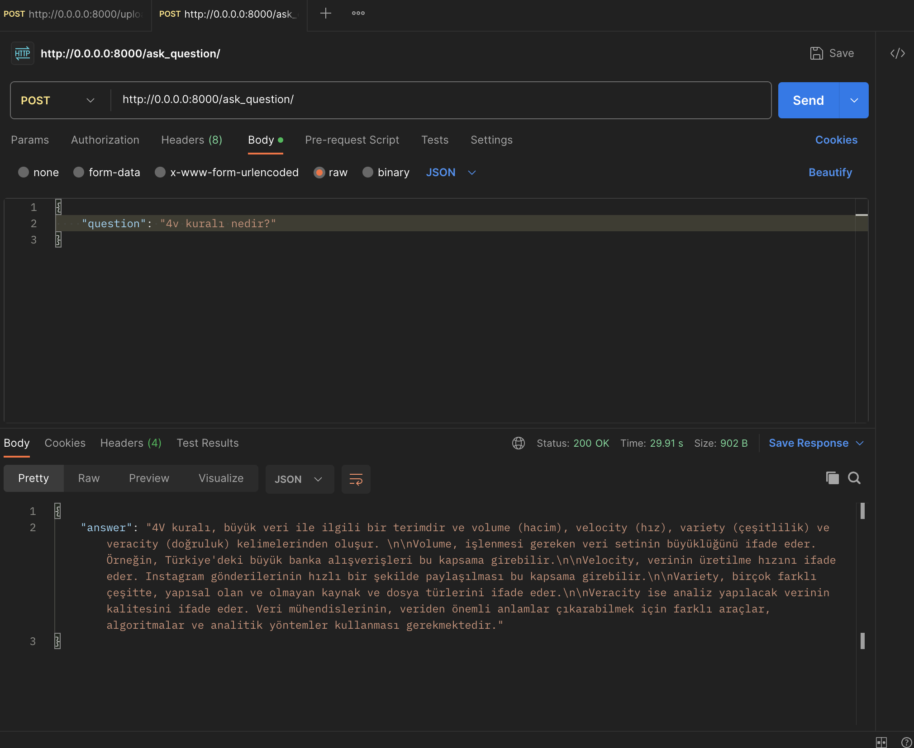

Rise ChatBot API
This API allows you to upload a PDF file and ask questions about it. The API will use a question-answering chain to find the answer to your question.

Endpoints
/upload/ - Upload a PDF file.
/ask_question/ - Ask a question about the PDF file.
Example

curl -X POST -F file=@my_pdf.pdf http://localhost:8000/upload/
This will upload the file my_pdf.pdf to the API.

curl -X POST -d '{"question": "What is the capital of France?"}' http://localhost:8000/ask_question/

Requirements
Python 3.9
FastAPI
Pinecone
Langchain
OpenAI
Installation
pip install -r requirements.txt

## Running the API

Docker Compose
To run the API using Docker Compose, you can use the following command:

docker-compose up --build -d
postman:

This will build the API image and start the API container. The API will be available on port 8000.

The docker-compose.yml file contains the configuration for Docker Compose.

Description
This API is built on top of the FastAPI framework.
It uses the Pinecone library to index the PDF files and the Langchain library to build the question-answering chain.
The OpenAI library is used to generate the embeddings for the PDF files.

The API is divided into two endpoints:

/upload/ - This endpoint is used to upload a PDF file. The file is first indexed by Pinecone and then the question-answering chain is built.
/ask_question/ - This endpoint is used to ask a question about the PDF file. The question is first converted to text and then the question-answering chain is used to find the answer.

# Pinecone Chatbot Index

# Postman -Ask Question

# Postman -Upload

# Swagger UI-Ask Question

# Swagger UI-Upload

